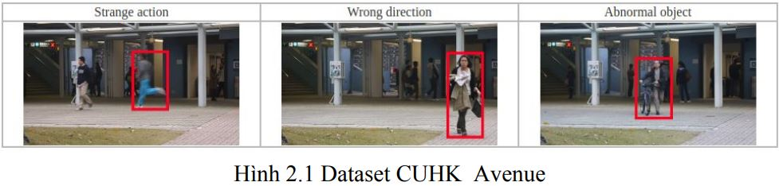
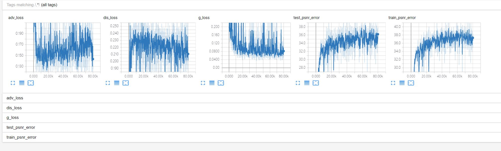
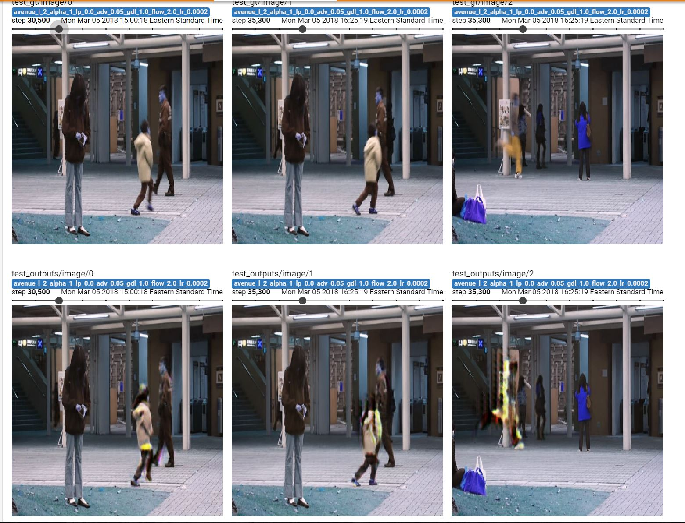

# Future Frame Prediction for Anomaly Detection -- Phát hiện bất thường trong video bằng Dự đoán khung hình
This repo is the source of our thesis, implemented in python tensorflow. [Demovideo](https://www.youtube.com/watch?v=5g9gU0_JiKU&list=PLaHlllAfhKRs9pCPTMCiReXmhJvJDdXTq&index=5)  
Check our [colap work](https://colab.research.google.com/drive/1wkpxYdcxFSrX0T45haedTnis0ROed9bb)  
- VŨ LÊ HOÀNG MINH  15520498  
- TRẦN KHẢ PHIÊU  15520614  


## 1. Installation (Anaconda with python3 installation)
* Install 3rd-package dependencies of python (listed in requirements.txt)
```
numpy==1.14.1
scipy==1.0.0
matplotlib==2.1.2
tensorflow-gpu==1.4.1
tensorflow==1.4.1
Pillow==5.0.0
pypng==0.0.18
scikit_learn==0.19.1
opencv-python==3.2.0.6
```
* Other libraries
```code
CUDA 8.0
Cudnn 6.0
```
## 2. Download datasets
cd into Data folder of project and run the this scripts for **ped1** and **ped2** data.
```shell
cd Data
git clone https://github.com/deathvn/ped2
git clone https://github.com/deathvn/ped1
```
or You can download all datasets from [ped1.tar.gz, ped2.tar.gz, avenue.tar.gz and shanghaitech.tar.gz](https://onedrive.live.com/?authkey=%21AMqh2fTSemfrokE&id=3705E349C336415F%215109&cid=3705E349C336415F)
and tar each tar.gz file, and move them in to **Data** folder.

## 3. Testing on saved models
* Download the trained models (There are the pretrained FlowNet and the trained models of the papers, such as ped1, ped2 and avenue).
```shell
cd checkpoints
git clone https://github.com/deathvn/pretrains
cd pretrains
```
Download pretrain models and move them to **pretrain** folder  
[Flownet_file1](http://download943.mediafire.com/hynmczvscd4g/gfpe28rfs4tptm1/flownet-SD.ckpt-0.data-00000-of-00001), [Flownet_file2](http://download1525.mediafire.com/1l504kua1zqg/feur15guonc09ul/flownet-SD.ckpt-0.meta)  
[Ped1](http://download843.mediafire.com/4r7jgo7jaebg/vj1nsd622vju6qx/ped1.data-00000-of-00001)  
[Ped2](http://download855.mediafire.com/4s8db04z901g/l241oo8msf1lg6o/ped2.data-00000-of-00001)  
[Avenue](http://download937.mediafire.com/xf5vl5dav6ag/mi9d2annamyh4bz/avenue.data-00000-of-00001)  
[Shanghaitech](http://download1649.mediafire.com/s0qjqln1qfqg/60za9d7exgv90ld/shanghaitech.data-00000-of-00001)  

* Running the sript (as ped2 and ped1 datasets for examples) and cd into **Codes** folder at first.
```shell
python inference.py  --dataset  ped2    \
                    --test_folder  ../Data/ped2/testing/frames      \
                    --gpu  1    \
                    --snapshot_dir    checkpoints/pretrains/ped2
```
[ped2 outvideo](https://www.youtube.com/watch?v=4Bfr0_MS1Vc&list=PLaHlllAfhKRs9pCPTMCiReXmhJvJDdXTq&index=6)
```shell
python inference.py  --dataset  ped1 \
                    --test_folder  ../Data/ped1/testing/frames      \
                    --gpu  1    \
                    --snapshot_dir    checkpoints/pretrains/ped1
```
[ped1 outvideo](https://www.youtube.com/watch?v=sxYy1TH9c_A&list=PLaHlllAfhKRs9pCPTMCiReXmhJvJDdXTq&index=7)

## 4. Training from scratch (here we use ped2 and avenue datasets for examples)
* Download the pretrained FlowNet at first and see above mentioned step 3.1 
* Set hyper-parameters
The default hyper-parameters are all initialized in **training_hyper_params/hyper_params.ini**. 
* Running script (as ped2 or avenue for instances) and cd into **Codes** folder at first.
```shell
python train.py  --dataset  ped2    \
                 --train_folder  ../Data/ped2/training/frames     \
                 --test_folder  ../Data/ped2/testing/frames       \
                 --gpu  0       \
                 --iters    80000
```
* Model selection while training
In order to do model selection, a popular way is to testing the saved models after a number of iterations or epochs (Since there are no validation set provided on above all datasets, and in order to compare the performance with other methods, we just choose the best model on testing set). Here, we can use another GPU to listen the **snapshot_dir** folder. When a new model.cpkt.xxx has arrived, then load the model and test. Finnaly, we choose the best model. Following is the script.
```shell
python inference.py  --dataset  ped2    \
                     --test_folder  ../Data/ped2/testing/frames       \
                     --gpu  1
```
Run **python train.py -h** to know more about the flag options or see the detials in **constant.py**.
```shell
Options to run the network.

optional arguments:
  -h, --help            show this help message and exit
  -g GPU, --gpu GPU    the device id of gpu.
  -i ITERS, --iters ITERS
                        set the number of iterations, default is 1
  -b BATCH, --batch BATCH
                        set the batch size, default is 4.
  --num_his NUM_HIS    set the time steps, default is 4.
  -d DATASET, --dataset DATASET
                        the name of dataset.
  --train_folder TRAIN_FOLDER
                        set the training folder path.
  --test_folder TEST_FOLDER
                        set the testing folder path.
  --config CONFIG      the path of training_hyper_params, default is
                        training_hyper_params/hyper_params.ini
  --snapshot_dir SNAPSHOT_DIR
                        if it is folder, then it is the directory to save
                        models, if it is a specific model.ckpt-xxx, then the
                        system will load it for testing.
  --summary_dir SUMMARY_DIR
                        the directory to save summaries.
  --psnr_dir PSNR_DIR  the directory to save psnrs results in testing.
  --evaluate EVALUATE  the evaluation metric, default is compute_auc
```
* (Option) Tensorboard visualization
```shell
tensorboard    --logdir=./summary    --port=10086
```
Open the browser and type **https://ip:10086**. Following is the screen shot of avenue on tensorboard.



Since the models are trained in cv2 BGR image color channels, the visualized images in tensorboard look different from RGB channels.

## Reference
This project is referenced from [Future Frame Prediction for Anomaly Detection -- A New Baseline, CVPR 2018](https://arxiv.org/pdf/1712.09867.pdf) - by Wen Liu, Weixin Lluo, Dongze Lian and Shenghua Gao.  
Thanks for [their nice work](https://github.com/StevenLiuWen/ano_pred_cvpr2018.git)!
