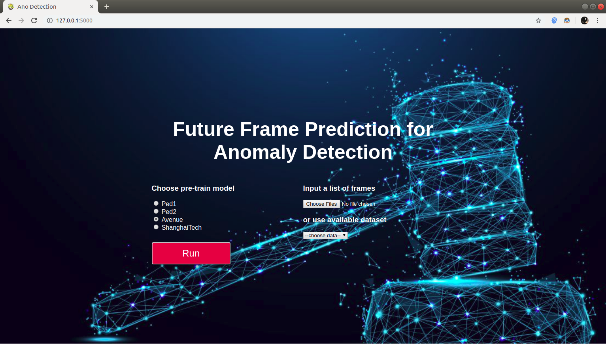

# Future Frame Prediction for Anomaly Detection -- Phát hiện bất thường trong video bằng Dự đoán khung hình
This repo is the source of our thesis, implemented in python tensorflow. [Demo Videos list](https://www.youtube.com/playlist?list=PLaHlllAfhKRsJYn3j9s60Oi1mA8FbxhQS)  
Check our [colap work](https://colab.research.google.com/drive/1wkpxYdcxFSrX0T45haedTnis0ROed9bb)  
- VŨ LÊ HOÀNG MINH  15520498  
- TRẦN KHẢ PHIÊU  15520614  


## 1. Installation
* Install 3rd-package dependencies of python
```
numpy==1.14.1
scipy==1.0.0
matplotlib==2.1.2
tensorflow-gpu==1.4.1
tensorflow==1.4.1
Pillow==5.0.0
pypng==0.0.18
scikit_learn==0.19.1
opencv-python==3.2.0.6
```
* Other libraries
```code
CUDA 8.0
Cudnn 6.0
```
## 2. Datasets
cd into **Data** folder of project and run the this scripts for **ped1** and **ped2** data.
```shell
cd Data
git clone https://github.com/deathvn/ped2
git clone https://github.com/deathvn/ped1
```
You also can download [Avenue](http://www.mediafire.com/file/o3op3dhb3uoosxj/avenue.zip/file) and [ShanghaiTech](http://www.mediafire.com/file/qskm7w88lqrhfuc/shanghaitech.zip/file), after that extract to **Data** folder.

## 3. Testing
* Download the pre-train models.
```shell
cd checkpoints
git clone https://github.com/deathvn/pretrains
cd pretrains
```
Download pretrain models and move them to **pretrain** folder  
[Flownet_file1](http://www.mediafire.com/file/gfpe28rfs4tptm1/flownet-SD.ckpt-0.data-00000-of-00001/file), [Flownet_file2](http://www.mediafire.com/file/feur15guonc09ul/flownet-SD.ckpt-0.meta/file)  
[Ped1](http://www.mediafire.com/file/vj1nsd622vju6qx/ped1.data-00000-of-00001/file)  
[Ped2](http://www.mediafire.com/file/l241oo8msf1lg6o/ped2.data-00000-of-00001/file)  
[Avenue](http://www.mediafire.com/file/mi9d2annamyh4bz/avenue.data-00000-of-00001/file)  
[Shanghaitech](http://www.mediafire.com/file/60za9d7exgv90ld/shanghaitech.data-00000-of-00001/file)  

* cd into **Codes** folder, after that running the scripts for test.
```shell
python inference.py  --dataset  ped2    \
                     --test_folder  ../Data/ped2/testing/frames      \
                     --gpu  0    \
                     --snapshot_dir    checkpoints/pretrains/ped2
```
[ped2 outvideo](https://youtu.be/zi8aNOG8olU)
```shell
python inference.py  --dataset  ped1 \
                     --test_folder  ../Data/ped1/testing/frames      \
                     --gpu  0    \
                     --snapshot_dir    checkpoints/pretrains/ped1
```
[ped1 outvideo](https://youtu.be/9o1mnPE1Iqw)
```shell
python inference.py  --dataset  avenue \
                     --test_folder  ../Data/avenue/testing/frames      \
                     --gpu  0    \
                     --snapshot_dir    checkpoints/pretrains/avenue
```
[avenue outvideo](https://youtu.be/aks5hEveyGk)
```shell
python inference.py  --dataset  shanghaitech \
                     --test_folder  ../Data/shanghaitech/testing/frames      \
                     --gpu  0    \
                     --snapshot_dir    checkpoints/pretrains/shanghaitech
```
[shanghaitech outvideo](https://youtu.be/kgXThRTjrSw)

### [optional] testing with UIT-dataset
```shell
python inference.py  --dataset  uit \
                     --test_folder  ../Data/uit/testing/frames      \
                     --gpu  0    \
                     --snapshot_dir    checkpoints/pretrains/uit
```
[uit outvideo](https://youtu.be/r46tGPYOS8E)

## 4. Training
* Set hyper-parameters in **training_hyper_params/hyper_params.ini**. 
* cd into **Codes** folder, After that, run this script.
```shell
python train.py  --dataset  ped2    \
                 --train_folder  ../Data/ped2/training/frames     \
                 --test_folder  ../Data/ped2/testing/frames       \
                 --gpu  0       \
                 --iters    80000
```
* Model selection while training
To model selection, run this script.
```shell
python inference.py  --dataset  ped2    \
                     --test_folder  ../Data/ped2/testing/frames       \
                     --gpu  1
```
Run **python train.py -h** to know more about the flag options or see the detials in **constant.py**.
```shell
Options to run the network.

optional arguments:
  -h, --help            show this help message and exit
  -g GPU, --gpu GPU    the device id of gpu.
  -i ITERS, --iters ITERS
                        set the number of iterations, default is 1
  -b BATCH, --batch BATCH
                        set the batch size, default is 4.
  --num_his NUM_HIS    set the time steps, default is 4.
  -d DATASET, --dataset DATASET
                        the name of dataset.
  --train_folder TRAIN_FOLDER
                        set the training folder path.
  --test_folder TEST_FOLDER
                        set the testing folder path.
  --config CONFIG      the path of training_hyper_params, default is
                        training_hyper_params/hyper_params.ini
  --snapshot_dir SNAPSHOT_DIR
                        if it is folder, then it is the directory to save
                        models, if it is a specific model.ckpt-xxx, then the
                        system will load it for testing.
  --summary_dir SUMMARY_DIR
                        the directory to save summaries.
  --psnr_dir PSNR_DIR  the directory to save psnrs results in testing.
  --evaluate EVALUATE  the evaluation metric, default is compute_auc
```

## 5. Web demo application

Install flask-ngrok to run the web demo application
```shell
pip install flask-ngrok
```
After install flask framework, cd to **Codes** folder, and run the web application by this script:
```shell
cd Codes
python app.py
```
Feel confuse with environments, or don't want to install anything, check our [colab work here](https://colab.research.google.com/drive/1wkpxYdcxFSrX0T45haedTnis0ROed9bb)!
## Reference
This project is referenced from [Future Frame Prediction for Anomaly Detection -- A New Baseline, CVPR 2018](https://arxiv.org/pdf/1712.09867.pdf) - by Wen Liu, Weixin Lluo, Dongze Lian and Shenghua Gao.  
Thanks for [their nice work](https://github.com/StevenLiuWen/ano_pred_cvpr2018.git)!
